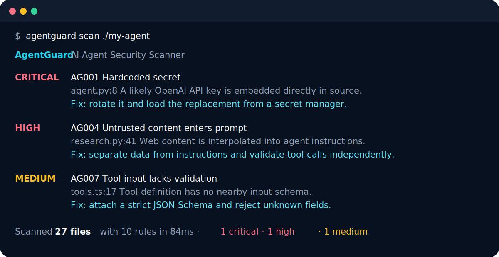
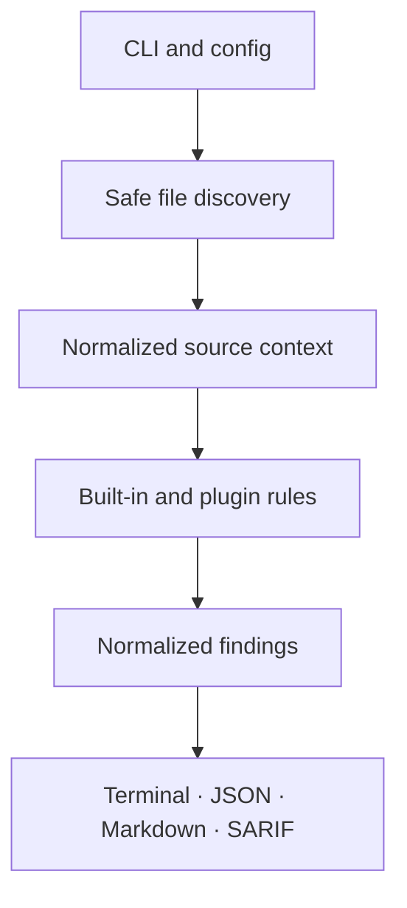

<div align="center">
  

  <p><strong>Find dangerous agent capabilities before they reach production.</strong></p>

  [](https://github.com/amic25/agentguard/actions/workflows/ci.yml)
  [](https://github.com/amic25/agentguard/actions/workflows/codeql.yml)
  [](https://pypi.org/project/agentguard-sast/)
  [](https://pypi.org/project/agentguard-sast/)
  [](LICENSE)
</div>

AgentGuard is an open-source static security scanner for AI agent applications. It looks for leaked secrets, prompt-injection paths, excessive permissions, unsafe system access, weak tool validation, risky outbound calls, missing human approval, and vulnerable dependencies in Python and JavaScript/TypeScript projects.

It is offline-first, CI-friendly, framework-aware, and designed to produce findings a developer can fix—not a wall of vague warnings.

```bash
pipx install agentguard-sast
agentguard scan ./project
```

<p align="center"></p>

## Why AgentGuard?

Agent applications combine untrusted natural-language input with credentials, tools, network access, and side effects. Traditional secret scanners and dependency audits each cover one slice; AgentGuard evaluates the agent-specific trust boundaries between them.

| What it checks | Examples | Rule |
|---|---|---|
| Secrets | OpenAI/AWS/GitHub keys, private keys, assigned credentials | `AG001` |
| Code execution | `eval`, `os.system`, shell subprocesses, Node child processes | `AG002` |
| Tool permissions | broad LangChain/CrewAI tools, dangerous flags, MCP wildcards | `AG003` |
| Prompt injection | untrusted web, document, request, or tool output in instructions | `AG004` |
| File access | user-controlled paths and broad filesystem roots | `AG005` |
| External APIs | plaintext HTTP, caller-controlled URLs, SSRF paths | `AG006` |
| Input validation | tools without strict typed or JSON schemas | `AG007` |
| Agent privileges | consequential actions without approval gates | `AG008` |
| Dependencies | bundled high-signal advisories and unpinned requirements | `AG009–AG010` |

AgentGuard recognizes common patterns from LangChain, CrewAI, AutoGen, OpenAI Agents/API applications, and MCP clients/servers. The rules are framework-tolerant: they inspect the security behavior rather than requiring one exact SDK version.

## Install

AgentGuard requires Python 3.10 or newer.

```bash
# Isolated CLI installation (recommended)
pipx install agentguard-sast

# Or with pip
python -m pip install agentguard-sast

# From source
git clone https://github.com/amic25/agentguard.git
cd agentguard
python -m pip install -e .
```

Docker users can run without installing Python dependencies locally:

```bash
docker build -t agentguard .
docker run --rm -v "$PWD:/workspace:ro" agentguard scan /workspace
```

## Use

Scan the current project and fail when a High or Critical issue is found:

```bash
agentguard scan .
```

Generate machine-readable or reviewable reports:

```bash
agentguard scan . --format sarif --output agentguard.sarif
agentguard scan . --format json --output agentguard.json --fail-on medium
agentguard scan . --format markdown --output security-report.md --fail-on none
```

Other useful commands:

```bash
agentguard rules                 # list built-in rules
agentguard init                  # create .agentguard.yml
agentguard scan src --exclude generated/**
```

Exit codes are stable for automation: `0` passed, `1` reached the configured severity threshold, and `2` means the scan could not complete.

### GitHub code scanning

```yaml
- name: Scan AI agent security
  run: agentguard scan . --format sarif --output agentguard.sarif --fail-on none
- name: Upload SARIF
  uses: github/codeql-action/upload-sarif@v3
  with:
    sarif_file: agentguard.sarif
```

### Configure and suppress

Create `.agentguard.yml`:

```yaml
exclude:
  - generated/**
disabled_rules:
  - AG010
severity_overrides:
  AG006: high
plugins:
  - company_agent_rules
max_file_size_kb: 1024
follow_symlinks: false
```

Suppress a reviewed false positive on the affected or previous line. Suppressions should explain the compensating control in code review.

```python
# URL is selected from a compile-time allowlist. agentguard: ignore[AG006]
response = requests.get(url, timeout=5)
```

## Reports

Every finding includes severity (`Critical`, `High`, `Medium`, or `Low`), stable rule ID, affected file/line/column, explanation, concrete risk, confidence, and remediation. Terminal output is optimized for humans; JSON has a versioned schema; Markdown is designed for security reviews; SARIF 2.1.0 integrates with GitHub code scanning.

## Plugins

Custom rules can be loaded from a module in `.agentguard.yml` or distributed as a Python package with an `agentguard.rules` entry point. The API uses the same stable `Rule`, `RuleMetadata`, `SourceFile`, and `Finding` objects as built-ins.

See [Plugin authoring](docs/PLUGINS.md) for a complete example and packaging instructions.

## Architecture



Rules never execute the target project. AgentGuard decodes supported text files, optionally builds a Python AST, and applies deterministic checks. See [Architecture](docs/ARCHITECTURE.md) and [Security model](docs/SECURITY_MODEL.md).

## Development

```bash
git clone https://github.com/amic25/agentguard.git
cd agentguard
python -m venv .venv
source .venv/bin/activate
python -m pip install -e '.[dev]'
make check
```

Contributions are welcome. Start with [CONTRIBUTING.md](CONTRIBUTING.md) or one of the [good first issue specifications](docs/GOOD_FIRST_ISSUES.md). Security reports should follow [SECURITY.md](SECURITY.md), not a public issue.

## Roadmap

- Deeper framework data-flow analysis and cross-file call graphs
- Live OSV advisory mode with a reproducible offline cache
- Policy packs for MCP, financial, healthcare, and enterprise agents
- Baseline/diff scanning for gradual adoption
- IDE integrations and an LSP
- Signed releases and Homebrew packaging

Details and acceptance criteria live in [ROADMAP.md](ROADMAP.md).

## Responsible use and limitations

AgentGuard is a defense-in-depth static analysis tool. It does not prove an agent is safe, replace threat modeling or runtime sandboxing, or execute target code. Heuristics can miss obfuscated or dynamically constructed behavior and can produce false positives. Review findings in context and combine AgentGuard with secret scanning, dependency auditing, least-privilege runtime controls, monitoring, and human approval for high-impact actions.

## License

Apache License 2.0. See [LICENSE](LICENSE). By contributing, you agree that your contributions are licensed under the same terms.
